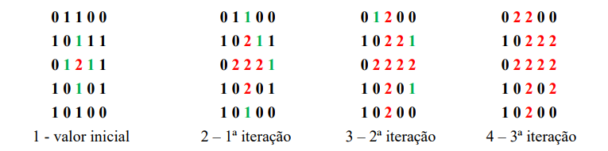

<h1> Questão: </h1>

Desenvolva um algoritmo que simule o contágio do coronavírus de uma forma simples. Suponha que cada pessoa infectada possa infectar somente 4 pessoas ao seu redor e que não necessariamente existem pessoas próximas, isso depende da taxa de isolamento que o grupo de pessoas está seguindo. Os dados que você deve solicitar ao usuário são: tamanho do espaço amostral, taxa de isolamento e número de infectados iniciais.

O tamanho do espaço amostral deve ser uma matriz N x M, criada dinamicamente. A taxa de isolamento deve ser usada para calcular a quantidade de valores vazios presentes no espaço amostral, o valor vazio indica uma distância entre as pessoas. Utilize valor 1 na matriz para indicar as pessoas, valor 0 para indicar espaço vazio devido o isolamento e 2 para indicar contaminados. Por exemplo, suponha que você tem uma matriz 4 x 4 com taxa de isolamento de 40, isso indica que 40% dos valores dessa matriz são de espaços vazios, aproximando teríamos 6 espaços vazios e 10 pessoas nesse espaço amostral. A distribuição das posições de pessoas e espaços vazios na matriz deve ser feito de forma aleatória, respeitando as quantidades obtidas pela taxa de isolamento e tamanho da matriz.

A quantidade de infectados iniciais diz respeito ao inicio da contaminação dentro desse espaço, para facilitar limite ao máximo 4 infectados iniciais, a posição desses infectados deve ser obtida aleatoriamente. A contaminação deve ser feita por interações, sempre atualizando os valores da matriz a cada iteração. Cada infectado pode contaminar apenas as 4 pessoas ao seu redor em uma interação, as pessoas que foram contaminadas na interação anterior passam a contaminar as 4 próximas que estão ao seu redor e isso se repete ao longo das interações até infectar todos os possíveis de acordo com o isolamento.

<h2 align="center">  </h2>

Observe que são apresentados nas matrizes os infectados (vermelho) e seus vizinhos que serão infectados na próxima interação (verde). Observe também que a presença dos espaços vazios 0 impedem a propagação da contaminação, evitando o contato entre as pessoas na matriz. Em cada iteração devem ser verificados os 4 vizinhos de cada infectado, buscando os próximos a serem contaminados na iteração seguinte e isso prossegue até atingir o máximo possível. Suponha um contaminado na posição (i, j), na próxima iteração os contaminados serão as posições (i+1, j), (i, j-1), (i-1, j) e (i, j+1) que tenham valores 1.

O programa finaliza quando não tiverem mais infectados em uma iteração e deve ser apresentado na saída o print das matrizes em cada iteração e quando finalizar o resumo da infecção: Espaço amostral simulado, taxa de isolamento, quantidade de infectados iniciais, porcentagem da população contaminada ao final, porcentagem da população saudável e quantidade de iterações que foram precisas.

<h2>Estágio de desenvolvimento:</h2>

 Neste momento o código está em fase final de desenvolviemnto, ainda eistem alguns bugs, porém os retoques finais estão por vir. Caso tenha alguma sugestão ficarei feliz em ler seu pull request! 

